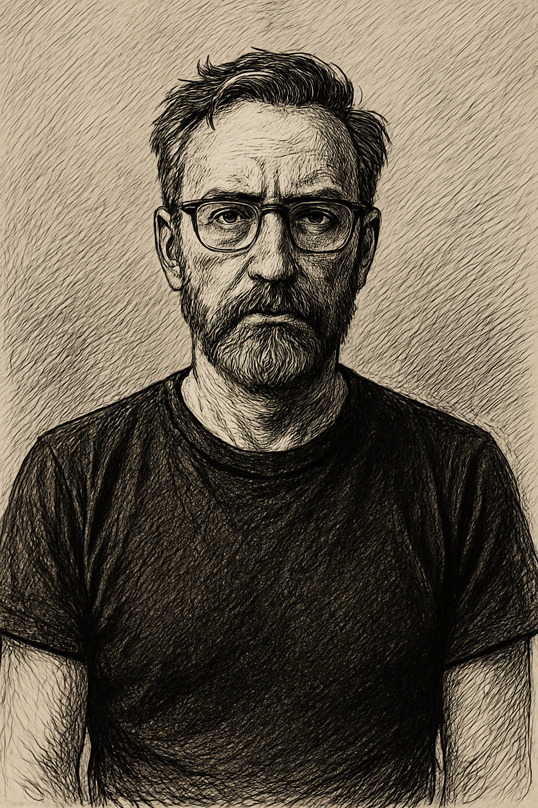

# About Cloven Distro – Tectum Framework

**Version**: `v0.1.0`  
**Commit**: `{{GIT_SHORT_HASH}}`  
**Updated**: `{{DATE}}`

---

The Tectum in the human brain orients the body and eyes toward relevant stimuli.  
This framework applies the same principle: orient AI systems toward **meaningful signal**, shielding them from distortion and noise.

---

## 👁 The Cloven

When you upload your Cloven image (`assets/cloven_brain.png`), this page will automatically render it as the **symbolic anchor** of the project:  
- **Clarity** in chaos  
- **Stability** in distortion  
- **Resilience** against systemic noise  

---

Future expansions include:
- Multi-agent orchestration
- Home Assistant integration
- Experimental AI “plug-and-play” modules

---

<!-- Hey 👋 thanks for viewing the source in your browser. 
Never gonna run around and desert you. -->
