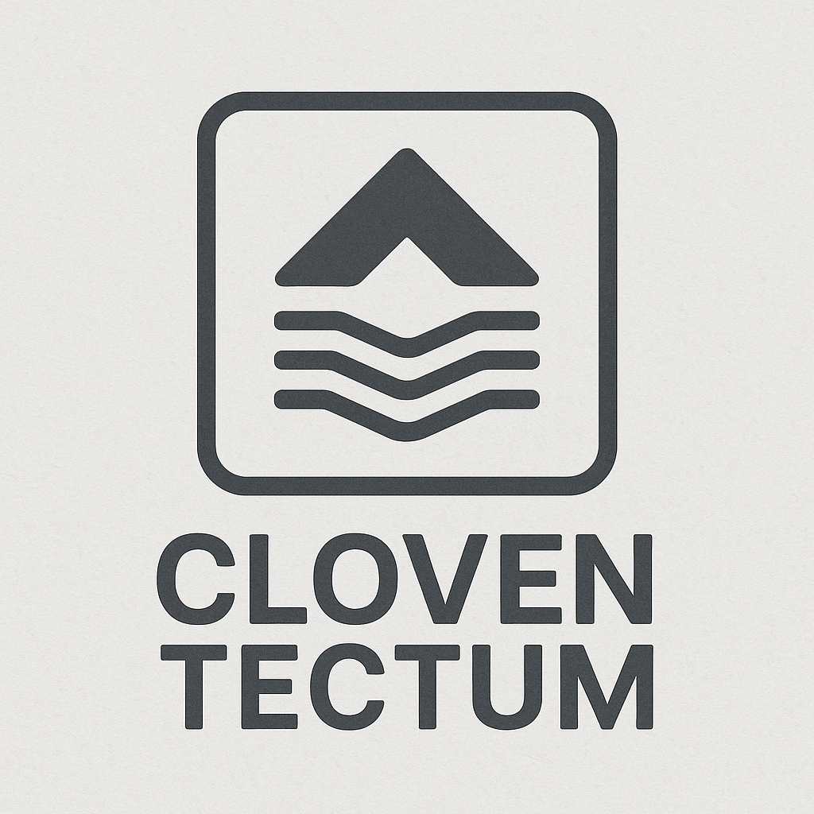

<p align="center">
  
</p>

# Cloven Tectum Framework

**A modular, distributed AI interaction framework** designed to harness LLMs for decentralized information retrieval, quorum-based interpretation, and layered narrative generation.

---

## 🧠 System Architecture

Cloven Tectum follows a tiered AI architecture:

1. **Top LLM (Narrative)** – Central brain that interprets results from various scrapers and builds cohesive, bias-filtered narratives.
2. **Postgres DB** – Acts as both job queue (`outbound_requests`) and result repository (`inbound_responses`).
3. **Scraper Agents** – Poll outbound requests and dispatch tasks to:
    - Local LLMs (e.g., Gemma via Ollama)
    - External APIs (e.g., OpenAI GPT-4)
    - Direct web scrapers (e.g., `news.ycombinator.com`)
4. **Inserters** – Store results from LLMs and scrapers back into the `inbound_responses` DB for processing.
5. **Narrative Builder** – Final stage polls results and synthesizes responses from the multi-agent quorum.

---

## 🚀 Features

- ✅ Modular agents with Docker support
- ✅ Ollama GPU inference (Gemma, Mistral, LLaMA)
- ✅ Quorum-based reasoning from multiple LLMs
- ✅ PostgreSQL job pipeline
- ✅ Full-stack Dockerized architecture
- ✅ Voice module (WIP)
- ✅ Home Assistant integration (planned)
- ✅ Sentiment, demographic lens & narrative drift detection (planned)

---

## 🛠️ Getting Started

```bash
git clone [https://github.com/yourname/Cloven_TectumFW.git](https://github.com/cycotek/Cloven_Distro_TectumFW)
cd Cloven_TectumFW
./serversetup.sh
```

Navigate to `http://localhost:8080` to access the web UI.

---

## 📁 Folder Structure

```
Cloven_Distro_TectumFW/
├── assets/                 # Logo, visual assets
├── tectum_framework/
│   ├── agents/
│   │   ├── inserter/       # Writes inbound responses
│   │   └── scraper/        # Dispatches outbound requests
│   ├── api_server/         # Web UI and coordination API
│   └── ollama/             # LLM container setup
├── docker-compose.yml
├── .env / .env.example
├── serversetup.sh         # Auto-provisioning script
└── teardown.sh            # Full system cleanup
```

---

## 🤘 Author

Created by **Cloven** – _“No gods. No devils. Only uptime.”_

<p align="center">
  
</p>
---

## 📜 License

MIT License. Use freely, modify respectfully, and contribute if you dare.
