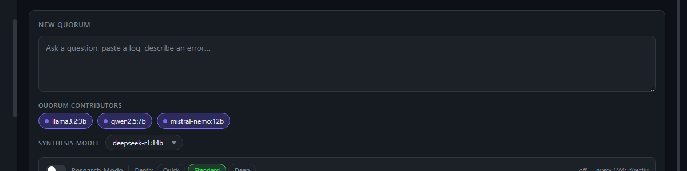
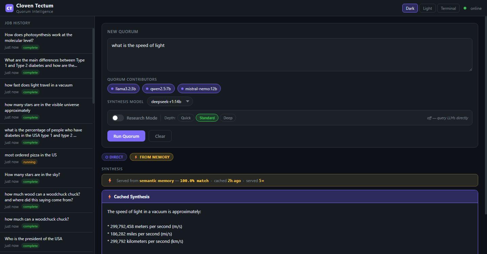
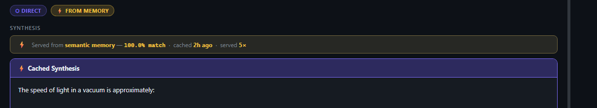
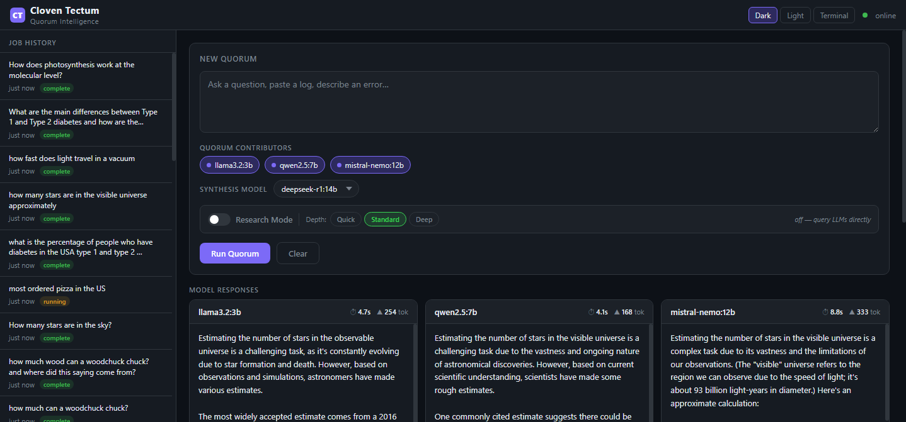
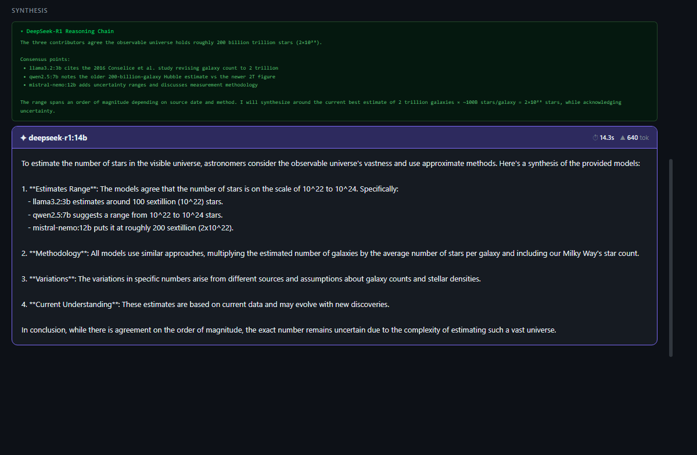
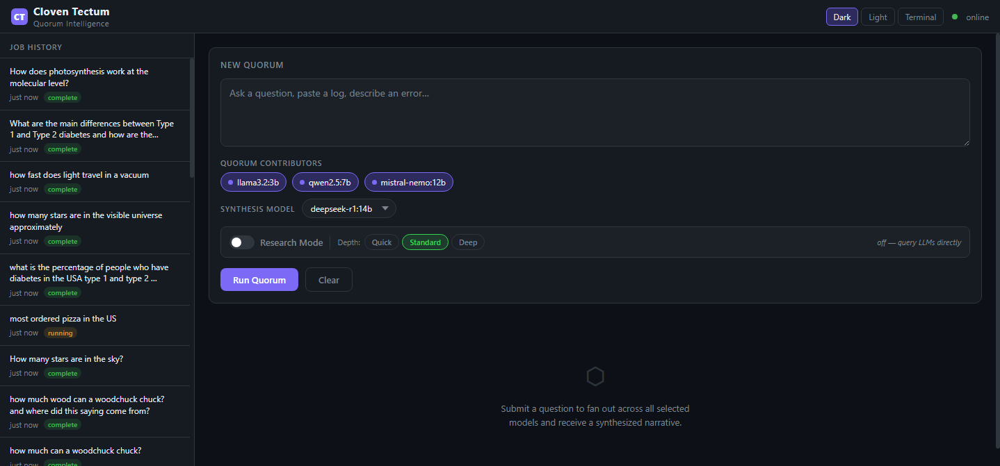

# Cloven Distro — TectumFW

**TectumFW** — and now **TectumFW Standalone MCP** (see [README.standalone.md](README.standalone.md)) — is a self-hosted reasoning layer for your local network. Ask it a question, or have your main AI query it as a tool. It routes that query intelligently: first it checks whether it already has the answer in its vector DB (semantic memory); on a miss, the fetcher gathers current web context, then the question fans out to the models in your Ollama library. Each model answers independently, and one model you designate acts as the controller — it reads them all and synthesizes a bias-filtered consensus (whichever model you pick for that role removes itself from the quorum). Answers are remembered semantically, so anything asked twice — even phrased differently — comes back instantly from cache. One command to deploy, nothing leaves your network, and any LLM or agent on your network can call it as a tool.

The **fetcher service alone** is a great tool for the aging, smaller LLMs we run: they can figure out whether they already have current information and, if not, use the fetcher to grab reasoned, structured context — the original question plus crawled RSS, Wikipedia, and news. Intent classification keeps it efficient: a settled science question won't trigger a long deep crawl, while a time-sensitive one pulls the latest information.

Beginner-friendly if you have **Docker** and **Python 3.11+** already installed — everything else comes up automatically.

> **Two flavors.** This repo is the all-in-one **bundled** stack (Ollama + GPU included, standard ports) documented below. For a decoupled deployment that attaches to an Ollama you already run and exposes Tectum to agents as an **MCP service** (the shape running on a Synology/NAS), see **[README.standalone.md](README.standalone.md)**.

---

## Architecture

```
User Query
    │
    ▼
┌─────────────────────────────────────────────────────┐
│  tectum_fetcher  —  Query Optimizer                 │
│  llama3.2:3b classifies intent at temperature=0     │
│  intent: direct | reference | news | logs | network │
└─────────────────────────────────────────────────────┘
    │
    ├── intent=news  ──► Auto-fetch live web context
    │                    (RSS, web crawl, Wikipedia)
    │
    ▼
┌─────────────────────────────────────────────────────┐
│  Tier 1: Semantic Memory (pgvector + nomic-embed)   │
│  Cosine similarity ≥ 0.82 → cache hit → return now  │
│  "how fast does light travel" finds cached          │
│  "what is the speed of light" at sim=0.846          │
└─────────────────────────────────────────────────────┘
    │ miss
    ▼
┌─────────────────────────────────────────────────────┐
│  Tier 2: Direct Path  (intent=direct)               │
│  Single model (llama3.2:3b), no debate              │
│  Math, constants, conversions, immutable facts      │
│  TTL=365 days — essentially permanent               │
└─────────────────────────────────────────────────────┘
    │ needs_quorum=True
    ▼
┌─────────────────────────────────────────────────────┐
│  Tier 3: Full Quorum  (intent=reference|news)       │
│  Fan out to 3 contributor models in parallel        │
│  DeepSeek-R1:14b synthesizes with visible reasoning │
│  TTL by intent: reference=30d, news=1d              │
└─────────────────────────────────────────────────────┘
    │
    ▼
Store to tectum_memory → serve future queries instantly
```

**Services:**
- `cloven_tectum_api` — FastAPI, 3-tier router, memory layer
- `cloven_tectum_fetcher` — Query optimizer + web crawler + context assembler
- `cloven_tectum_db` — PostgreSQL 17 + pgvector
- `cloven_ollama` — Ollama with full NVIDIA GPU passthrough

---

## Quick Start

```bash
git clone https://github.com/cycotek/Cloven_Distro_TectumFW
cd Cloven_Distro_TectumFW
cp .env.example .env
# Edit .env — set your model names
docker compose up -d --build
```

Pull required models:
```bash
docker exec cloven_ollama ollama pull deepseek-r1:14b
docker exec cloven_ollama ollama pull mistral-nemo:12b
docker exec cloven_ollama ollama pull qwen2.5:7b
docker exec cloven_ollama ollama pull llama3.2:3b
docker exec cloven_ollama ollama pull nomic-embed-text
```

Navigate to `http://localhost:8000` for the UI, or `http://localhost:8000/docs` for the API.

---

## Using the UI

Navigate to `http://localhost:8000` to open the TectumFW interface. Everything in the pipeline is accessible from this single page.

---

### The Query Panel


> *The query panel — question input, contributor chips (llama3.2:3b, qwen2.5:7b, mistral-nemo:12b), deepseek-r1:14b synthesis selector, Research Mode toggle with Quick/Standard/Deep depth, and Run Quorum button.*

**Question box** — type your question here. Any length is supported; the optimizer reads the full text to classify intent before routing.

**Quorum Contributors** — colored chips showing each available model pulled from Ollama. Click a chip to toggle it in or out of the contributor pool. Green dot = included, dimmed = excluded. The synthesis model is automatically excluded from this list.

**Synthesis Model** — dropdown showing available models. Defaults to `deepseek-r1:14b`. This model reads all contributor responses and writes the final narrative. Swap it per-query without changing any config.

**Research Mode toggle** — off by default. When enabled, tectum_fetcher crawls live web sources (RSS, Wikipedia, web pages) before the quorum runs and injects that context into every model's prompt. Depth buttons (Quick / Standard / Deep) control crawl time: ~30s, ~2min, ~10min respectively. Note: queries classified as `news` intent trigger a fetch automatically even with this toggle off.

**Run Quorum / Clear** — Run submits the question through the full 3-tier pipeline. Clear resets the result area without clearing the question box.

---

### Status Bar


> *The status bar mid-request — spinner, teal QUORUM badge, and "Checking memory, classifying…" phase text.*

While a request is running, a status bar appears below the query panel showing the current phase: memory check, classification, fetch (teal highlight when fetcher is active), or quorum inference.

---

### Result Badges

Every completed result shows a badge row indicating how it was served:

| Badge | Meaning |
|-------|---------|
| `⬡ DIRECT` | Query classified as immutable fact (math, constant, conversion) |
| `→ DIRECT` | Answer served by single fast-path model, no quorum |
| `⚡ FROM MEMORY` | Answer served from semantic memory cache, zero inference |
| `⬡ REFERENCE` | Full quorum ran, encyclopedic question |
| `⬡ NEWS` | Full quorum ran with auto-fetched live context |
| `⬡ QUORUM ×3` | N contributor models ran in parallel |


> *`⬡ DIRECT` + `⚡ FROM MEMORY` — "what is the speed of light" served from semantic memory cache at 100% match, cached 47 minutes ago, served 3 times. Zero inference cost.*


> *Badge row close-up: `⬡ DIRECT` confirms immutable-fact intent; `⚡ FROM MEMORY` confirms the answer was pulled from pgvector, not from any model.*

---

### Memory Hit Panel


> *The memory meta bar: "Served from semantic memory — 100.0% match · cached 47m ago · served 3×". Similarity, freshness, and hit count at a glance.*

When a result comes from semantic memory, a meta bar appears above the synthesis showing:
- **Match %** — cosine similarity between this query and the cached query (≥ 82% to qualify)
- **Cached** — how long ago the answer was stored
- **Served ×N** — how many times this cached entry has been returned

---

### Model Response Cards


> *Screenshot: three contributor response cards side-by-side showing model name, response time, and token count.*

Each contributor model gets its own card showing the raw response, inference time (⏱), and output token count (▲). These are the independent answers R1 synthesizes across. Cards only appear on full quorum runs — direct path and memory hits show a single synthesis panel.

---

### Synthesis Panel and R1 Reasoning


> *Screenshot: the synthesis panel with R1's narrative and the collapsed reasoning block beneath it.*

The synthesis panel shows the final narrative from the synthesis model. When DeepSeek-R1 is used, a **▶ R1 Reasoning** collapsible section appears beneath the narrative — this is R1's raw `<think>` block, showing the internal reasoning chain it used to weigh the contributor responses before writing the answer.

---

### History Sidebar


> *Full UI view — the JOB HISTORY sidebar lists every query with status (complete / running / error). Header shows "CT Cloven Tectum · Quorum Intelligence" with Dark/Light/Terminal theme switcher and live online indicator. Click any history entry to reload that result.*

The sidebar lists recent jobs pulled from the database. Click any entry to reload that result. Status pills: green `complete`, yellow `running`, red `error`.

---

### Theme Toggle

The top-right corner has **Dark / Light / Terminal** theme buttons. Preference is saved to localStorage and restored on next visit.

---

### UI Screenshots

All screenshots above are captured and live in [`assets/screenshots/`](assets/screenshots/):

| Filename | Status | What to capture |
|----------|--------|----------------|
| `ui_query_panel.png` | ✅ have it | Query panel — chips, selectors, Research Mode toggle |
| `ui_status_bar.png` | ✅ have it | "QUORUM · Checking memory, classifying…" status bar |
| `ui_badges_memory.png` | ✅ have it | Badge row close-up — `⬡ DIRECT` + `⚡ FROM MEMORY` |
| `ui_memory_hit.png` | ✅ have it | Memory meta bar — sim%, age, serve count |
| `ui_full_memory.png` | ✅ have it | Full view — query panel + badges + cached synthesis |
| `ui_history.png` | ✅ have it | Full UI with history sidebar |
| `ui_model_cards.png` | ✅ have it | Three contributor cards from a full quorum run |
| `ui_synthesis.png` | ✅ have it | Synthesis panel with R1 `▶ Reasoning` block expanded |

---

## The 3-Tier Pipeline

### Tier 1 — Semantic Memory Cache
Every synthesized answer is embedded (nomic-embed-text, 768-dim) and stored in pgvector. Before running any inference, the query is embedded and searched via cosine similarity. A score ≥ 0.82 is a cache hit — the stored answer returns instantly, no models queried.

The cache matches *meaning*, not string equality. "How fast does light travel" correctly hits a cached answer for "What is the speed of light" (sim=0.846).

TTL is per-intent: physics constants cache for 365 days, encyclopedic reference for 30 days, news for 1 day, logs/network are never cached.

### Tier 2 — Direct Fast-Path
Questions with one immutable correct answer (math, physical constants, unit conversions, fixed historical dates) skip the quorum entirely. llama3.2:3b answers in ~3s warm. Result goes straight to memory with TTL=365 days.

### Tier 3 — Full Quorum with R1 Synthesis
Everything else fans out to 3 contributor models in parallel. DeepSeek-R1:14b reads all responses and synthesizes a bias-filtered narrative. R1's internal reasoning chain (`<think>` blocks) is captured and surfaced in the UI as a collapsible section.

### Auto-Fetch for News Intent
Queries classified as `news` automatically trigger tectum_fetcher before the quorum runs — no Research Mode toggle needed. Model training data is frozen; for anything time-sensitive the fetcher pulls live RSS, web, and Wikipedia sources and injects them as context.

---

## tectum_fetcher — How It Works

The fetcher is a standalone FastAPI service that handles everything related to understanding a query and gathering real-world context for it. The main API calls it but it runs independently and can be used by anything on the network.

**Stage 1 — Query Optimizer**
Every query first hits the optimizer, which uses llama3.2:3b at temperature=0 (deterministic) to classify intent and expand the query into structured search terms. It returns a `QueryPacket`: the original query, intent classification, expanded search strings, target source types, recommended depth, and TTL. This is what decides whether a question goes direct, to the quorum, or needs live data first.

**Stage 2 — Ant Crawler**
For queries that need live context (news, reference with fetch enabled), the crawler fans out to multiple source types in parallel: RSS feeds, Wikipedia, and general web pages. Each source fetches and cleans the raw content — stripping boilerplate, extracting meaningful text — then passes it downstream.

**Stage 3 — Context Assembler**
The cleaned source documents are ranked by relevance to the original query and concatenated into a single context block with source attribution. This gets injected verbatim into every contributor model's prompt before the quorum runs, so all three models are reasoning from the same live information.

The result is that a question like "who is the current US president" doesn't rely on training data cutoffs — it reads the answer from a live source, injects it as context, and the quorum reasons on top of that.

**As a standalone service**, the fetcher accepts requests at `http://localhost:8001` independently of TectumFW. Any service on the network can POST a query, get a `job_id`, poll for completion, and retrieve the assembled context. This makes it a general-purpose research broker — the natural evolution is a persistent service that pre-fetches topics on a schedule, caches context in pgvector, and serves it on demand to any consumer.

---

## Adding and Removing Models

The default configuration ships with four models chosen to demonstrate the pipeline on modest hardware. This is intentional — it's a small-scale proof of concept, not a production fleet.

```bash
# Pull any model available in the Ollama library
docker exec cloven_ollama ollama pull phi4:14b
docker exec cloven_ollama ollama pull gemma3:12b
docker exec cloven_ollama ollama pull command-r:35b

# List what's loaded
docker exec cloven_ollama ollama list
```

To add a model to the quorum, edit `.env`:
```
QUORUM_MODELS=mistral-nemo:12b,qwen2.5:7b,llama3.2:3b,phi4:14b
```

Then restart the API (no rebuild needed — models are resolved at runtime):
```bash
docker compose restart cloven_tectum_api
```

The UI's contributor chips update automatically on next load. You can also override models per-request via the UI checkboxes or the `models` field in the API payload — no config change needed for one-off experiments.

**Synthesis model** is separate. Swap it for anything larger or more capable:
```
SYNTHESIS_MODEL=command-r:35b
```

**What scales with more models:** quorum diversity improves — more architectures, more training distributions, more angles for R1 to synthesize across. The pipeline is intentionally model-agnostic. With enough VRAM you could run 6 contributors and a 70B synthesis model using the exact same code.

**What doesn't scale here:** the fetcher's web crawler is single-threaded and capped at a handful of sources per query. The memory layer is single-node Postgres. This is a framework demonstration, not a distributed system — the architecture shows what's possible, not what's production-ready.

---

## API Reference

| Method | Endpoint | Description |
|--------|----------|-------------|
| `GET` | `/` | Web UI |
| `GET` | `/health` | Health check |
| `GET` | `/config` | Current model config |
| `GET` | `/models/split` | Contributors vs synthesis model |
| `POST` | `/quorum/sync` | Full 3-tier pipeline, synchronous |
| `GET` | `/quorum/history` | Recent jobs |
| `GET` | `/quorum/{id}` | Job status + responses + narrative |
| `GET` | `/memory/search?q=&threshold=` | Debug: search semantic memory |

---

## Configuration

| Variable | Default | Description |
|----------|---------|-------------|
| `QUORUM_MODELS` | `mistral-nemo:12b,qwen2.5:7b,llama3.2:3b` | Contributor models |
| `SYNTHESIS_MODEL` | `deepseek-r1:14b` | Final synthesis model |
| `DIRECT_MODEL` | `llama3.2:3b` | Fast-path model for direct queries |
| `EMBED_MODEL` | `nomic-embed-text` | Embedding model for memory layer |
| `MEMORY_SIMILARITY_THRESHOLD` | `0.82` | Cosine similarity required for cache hit |
| `OLLAMA_HOST` | `http://ollama:11434` | Ollama service endpoint |

---

## Potential Applications

**Knowledge Management** — submit research questions repeatedly; first run pays full cost, subsequent similar questions return from cache. Useful for internal wikis, documentation assistants, or study tools.

**Bias-Filtered Analysis** — fan the same question to 3 different model architectures and let R1 synthesize across them. Useful anywhere a single model's perspective is insufficient: threat analysis, legal research, technical decisions.

**Temporal Awareness** — the intent classifier distinguishes immutable facts from time-sensitive queries and routes accordingly. Useful as a layer under any application that mixes static knowledge and live data needs.

**Network-Local AI** — entirely air-gapped capable. All inference runs inside your network via Ollama. No telemetry, no external API calls, no data leaves the host.

**Research Augmentation** — Research Mode triggers multi-source web crawling (RSS, Wikipedia, web crawl) before the quorum runs. The assembled context is injected into every contributor model's prompt. Useful for keeping answers grounded in current sources.

**Shard / Broker Architecture (future)** — tectum_fetcher is already a standalone HTTP service that can be called by anything on the network. The natural next step is a persistent data broker: services submit fetch requests, results are cached in pgvector, and any consumer can retrieve context on demand.

---

## Author

Created by **Cloven** — *"No gods. No devils. Only uptime."*

<p align="center">
  
</p>

---

## License

MIT License. Use freely, modify respectfully, and contribute if you dare.
