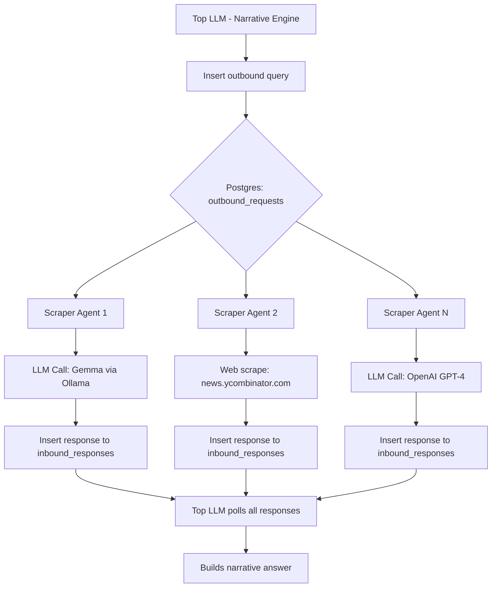

  

# Cloven Distro: TectumFW 🧠🕸️

**Cloven_TectumFW** is a modular agent orchestration stack designed to route queries through multiple local or remote LLM endpoints (e.g., Gemma, GPT-4, Ollama) with quorum-based result merging, autonomous scraping agents, and fully containerized PostgreSQL-backed storage.

The name *Tectum* (Latin for "roof") represents the role this system plays: a narrative roof layered above scrapers, agents, and inference engines.

---

## ⚙️ Overview

---

## 🧩 Architecture

### Components:
- **Top LLM**: Decision layer; sends outbound queries to DB, collects results, builds narratives.
- **PostgreSQL**: Central broker for all requests and responses.
- **Scraper Agents**: Poll outbound requests, route to data sources or LLM endpoints.
- **LLMs**: Configurable inference endpoints (local or API).
- **Inserters**: Responsible for writing structured results back to the DB.

### Features:
- 🔄 **Quorum Reasoning** – Results are collected from 3+ LLMs to form a consensus.
- 📬 **Postgres-MQ Design** – Pub-sub via DB tables; dead-simple and durable.
- 🕸️ **Web + Model Fusion** – Mixes LLM queries with live scrapes for hybrid responses.
- 🔧 **Docker-Based** – Fully containerized, zero-install local deployment.
- 🎛️ **GPU Optional** – Ollama supports CUDA if configured properly.

---

## 📦 Stack

| Service           | Port  | Purpose                              |
|------------------|-------|--------------------------------------|
| WebUI             | 8080  | Frontend + management portal         |
| API               | 8000  | Main orchestration layer (Python)    |
| Ollama            | 11434 | Local LLM runtime for models         |
| Scrapers          | 8081+ | External fetchers + LLM callers      |
| Postgres          | 5432  | Request/response and metadata store  |

---

## 🚧 Status

- ✅ Local login, LLM execution, and WebUI operational
- 🔄 Scraper agent orchestration and quorum logic under active development
- 🧪 GPU acceleration (CUDA + nvidia-docker) available but optional
- 📈 Planned: Voice modules, narrative drift detection, Home Assistant bridge

---

## 👁️ Vision

Cloven_TectumFW aims to become a **general-purpose narrative synthesis stack**, suitable for use cases such as:

- Private assistant LLMs that **never touch the web**
- Autonomous agents that **refactor, fact-check, and quorum-check each other**
- Scrapers that **generate structured, sentiment-scored, or multi-perspective output**
- Federated model runners (e.g., Gemma locally, GPT-4 remotely) in consensus

---

> _“No gods. No devils. Only uptime.”_ – Cloven
